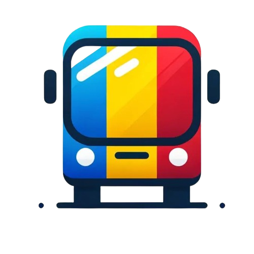

<!-- Improved compatibility of back to top link: See: https://github.com/othneildrew/Best-README-Template/pull/73 -->

<!--
*** Thanks for checking out the Best-README-Template. If you have a suggestion
*** that would make this better, please fork the repo and create a pull request
*** or simply open an issue with the tag "enhancement".
*** Don't forget to give the project a star!
*** Thanks again! Now go create something AMAZING! :D
-->

<!-- PROJECT SHIELDS -->
<!--
*** I'm using markdown "reference style" links for readability.
*** Reference links are enclosed in brackets [ ] instead of parentheses ( ).
*** See the bottom of this document for the declaration of the reference variables
*** for contributors-url, forks-url, etc. This is an optional, concise syntax you may use.
*** https://www.markdownguide.org/basic-syntax/#reference-style-links
-->
[![LinkedIn][linkedin-shield]][linkedin-url]

<!-- PROJECT LOGO -->
 

  

<h3 align="center">CTP Bus Tracking</h3>

  

    Real-time bus tracking using Tranzy API
     
    <a href="doc/CTPentru_Toti_documentation.pdf"><strong>Explore the docs »</strong></a>
     
     
    <a href="https://ctp-bus-tracking.vercel.app/">View Demo</a>
  

<!-- TABLE OF CONTENTS -->

  
Table of Contents

  <ol>
    <li>
      <a href="#about-the-project">About The Project</a>
      <ul>
        <li><a href="#built-with">Built With</a></li>
      </ul>
    </li>
    <li><a href="#roadmap">Roadmap</a></li>
    <li><a href="#acknowledgments">Acknowledgments</a></li>
  </ol>

<!-- ABOUT THE PROJECT -->
## About The Project

[![CTP Bus Tracking Screenshot][product-screenshot]](https://github.com/ciomin/ctp-bus-tracking)

The CTP Bus Tracking project is a web-based application that uses Google Maps and the Tranzy.Dev API to monitor bus routes and vehicle locations. With this tool, users can view various bus lines, routes, and stops on an interactive map, selecting their preferred line to see specific details. The project uses Angular components and the Google Maps API to visually represent real-time public transit data.

### Features:

- Displays bus lines and stops on a Google Map interface.
- Allows users to toggle between different bus routes.
- Fetches transit data through the Tranzy.Dev API.

(<a href="#readme-top">back to top</a>)

### Built With

* [![Angular][Angular.io]][Angular-url]
* [![Express][Express.js]][Express-url]
* [![Node][Node.js]][Node-url]
* [![Socket][Socket.IO]][Socket-url]
* [![GoogleMaps][Google-Maps-API]][Google-Maps-url]

(<a href="#readme-top">back to top</a>)

<!-- ROADMAP -->
## Roadmap

- [ ] Refactor `map.component.ts` for better code organization
    - [ ] Restructure files
- [ ] Implement real-time bus location updates using Socket.IO
- [ ] Improve the route selection interface for better usability
- [ ] Restrict panning beyond relevant map areas and remove built-in Google Maps buttons (Fullscreen, Street View)

(<a href="#readme-top">back to top</a>)

<!-- ACKNOWLEDGMENTS -->
## Acknowledgments

* [Radu Calomfirescu](https://github.com/StarSeeker17)

(<a href="#readme-top">back to top</a>)

<!-- MARKDOWN LINKS & IMAGES -->
<!-- https://www.markdownguide.org/basic-syntax/#reference-style-links -->
[linkedin-shield]: https://img.shields.io/badge/-LinkedIn-black.svg?style=for-the-badge&logo=linkedin&colorB=555
[linkedin-url]: https://www.linkedin.com/in/cosmin-iacobut/
[product-screenshot]: doc/images/product_screenshot.png
[Angular.io]: https://img.shields.io/badge/Angular-DD0031?style=for-the-badge&logo=angular&logoColor=white
[Angular-url]: https://angular.io/
[Express.js]: https://img.shields.io/badge/Express.js-f0db4f?style=for-the-badge&logo=express&logoColor=000000
[Express-url]: https://expressjs.com/
[Node.js]: https://img.shields.io/badge/Node.js-91f577?style=for-the-badge&logo=nodedotjs
[Node-url]: https://nodejs.org
[Socket.IO]: https://img.shields.io/badge/Socket.IO-9e9e9e?style=for-the-badge&logo=socketdotio&logoColor=101010
[Socket-url]: https://socket.io/
[Google-Maps-API]: https://img.shields.io/badge/Google%20Maps%20API-4285F4?style=for-the-badge&logo=googlemaps&logoColor=ea4335
[Google-Maps-url]: https://developers.google.com/maps

